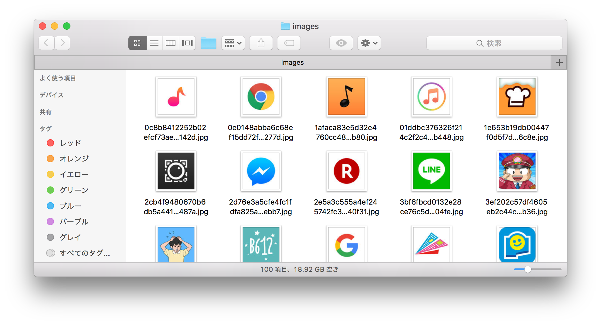

# Pythonクローリング&スクレイピング 練習問題

これはPythonでクローリング・スクレイピングを行うための練習問題です。
好きな問題をやってみてください。

1. [\[初級\] QiitaアドベントカレンダーのURL一覧を取得する](#1-初級-qiitaアドベントカレンダーのurl一覧を取得する)
2. [\[初級\] みずほ銀行の外貨普通預金を取得する（表のスクレイピング）](#2-初級-みずほ銀行の外貨普通預金を取得する表のスクレイピング)
3. [\[中級\] 明日の天気を取得する（APIによるデータ取得）](#3-中級-明日の天気を取得するapiによるデータ取得)
4. [\[中級\] iOSの人気アプリのアイコンを収集する（画像収集）](#4-中級-iosの人気アプリのアイコンを収集する画像収集)
5. [\[上級\] 技術評論社の電子書籍情報の収集（複数のページのクローリング）](#5-上級-技術評論社の電子書籍情報の収集複数のページのクローリング)
6. [\[上級\] Amazon.co.jp注文履歴の取得（Webページへのログイン）](#6-上級-amazoncojp注文履歴の取得webページへのログイン)

回答例は[answer](./answer)ディレクトリ内にあります。


## 1. [初級] QiitaアドベントカレンダーのURL一覧を取得する

アドベントカレンダーはすっかり年末の風物詩となりました。
Qiitaの「クローラー／Webスクレイピング Advent Calendar 2016」に登録された記事の一覧を取得します。気になるものがあれば読んでみても良いでしょう。

### 問題

以下のページから25日分の記事のURLとタイトルを取得して表示してください。

クローラー／Webスクレイピング Advent Calendar 2016 - Qiita  
http://qiita.com/advent-calendar/2016/crawler

### 期待する出力例

```
http://amacbee.hatenablog.com/entry/2016/12/01/210436 scrapy-splashを使ってJavaScript利用ページを簡単スクレイピング
http://qiita.com/Azunyan/items/9b3d16428d2bcc7c9406 Python Webスクレイピング 実践入門
http://qiita.com/spaceprobe/items/7f90cb3a3d5a4f5ac5af ウェブクローラN本ノック
http://blog.takuros.net/entry/2016/12/05/082533 非エンジニアでも何とか出来るクローラー／Webスクレイピング術
http://qiita.com/hanaken_Nirvana/items/fc1505ede087d0119883 Scrapy&Twitter Streaming APIを使ったTweetのクローリング
http://qiita.com/checkpoint/items/0c8ad814c25e85bbcfa2 Scrapy入門（３）
http://qiita.com/rllllho/items/cb1187cec0fb17fc650a 便利なXPathまとめ
http://qiita.com/massa142/items/a48e2deb09bca5407afd tseを使って未投稿があるQiita Advent Calendarをさらす
http://qiita.com/hotu_ta/items/592f751044ed9219db97 Selenium Builderでスクレイピング/クローラー入門・実践
http://blog.mudatobunka.org/entry/2016/12/18/205833 Scrapy+AWS LambdaでWeb定点観測のイレギュラーに立ち向かう
http://qiita.com/TakesxiSximada/items/39b905ef628b22f963e4 Pythonのseleniumライブラリからphantomjsを使ったらzombieになった
http://anoninoni.hateblo.jp/entry/2016/12/12/020558 AWS上にサーバレスな汎用クローラを展開するぞ。
http://happyou-info.hatenablog.com/entry/2016/12/13/000000 中華人民共和国大使館のスクレイピング
http://qiita.com/Hassan/items/ca55b84a093dd6935c56 Twitter Streaming APIを使った【夢】のクローリング
http://blog.takuros.net/entry/2016/12/25/173900 Pythonクローラー本の決定版か！？　『Pythonクローリング&スクレイピング』
http://orangain.hatenablog.com/entry/duktape PhantomJSとか使わずに簡単なJavaScriptを処理してスクレイピング
http://qiita.com/imunew/items/0786fd5c9255d4c9a18c Scrapy Cloudでスクレイピングした成果物をS3にアップロードする
http://blog.takuros.net/entry/2016/12/12/022750 ServerLessで、Amazonのほしい物リストから安売り情報を通知するBotを作ったよ
http://qiita.com/yamitzky/items/44a3ea178c750f356b4a mitmproxyを使ってどんなサイトでもクローリング・スクレイピングする
http://qiita.com/mpppk/items/5e8ac21274e9431afbbe JavaScriptでブラウザを自動操作できるnightmarejsを使ってガストのクーポンを自動発行する
http://leko.jp/archives/908 Selenium IDEで作ったテストをCLIで動かす方法
http://happyou-info.hatenablog.com/entry/2016/12/22/002439 やはり普及してはならないアンチスクレイピングサービス
http://blog.takuros.net/entry/2016/11/18/102815 「データを集める技術」という本を執筆しました
http://blog.takuros.net/entry/2016/10/24/080959 Amazonのほしい物リストをRSS化するAPIを作ってみた
http://shinyorke.hatenablog.com/entry/2016/12/25/172917 Pythonを用いたWebスクレイピングの開発ノウハウ〜スポーツデータの場合(野球風味)
```

### ボーナス

余裕があれば記事の著者も出力してみましょう。

## 2. [初級] みずほ銀行の外貨普通預金を取得する（表のスクレイピング）

金融機関のWebサイトにはいろいろな表が掲載されています。
毎日自動で取得したら、景気の変動と連動していることがわかるかもしれません。

### 問題

以下のページから外貨普通預金の通貨ごとの金利を取得して表示してください。

みずほ銀行 : 外貨預金金利  
https://www.mizuhobank.co.jp/rate/interest.html

### 期待する出力例

```
 外貨普通預金金利（％）（年率・税引前）
米ドル 0.350
英ポンド 0.100
ユーロ 0.001
豪ドル 0.300
ニュージーランドドル 0.300
スイスフラン 0.001
```

### ボーナス

pandasを使っている場合は、pandas.read_html()関数を使うとHTMLの表を簡単にデータフレームに変換できます。
良かったら試してみてください。

pandas.read_html — pandas 0.19.2 documentation  
http://pandas.pydata.org/pandas-docs/stable/generated/pandas.read_html.html


## 3. [中級] 明日の天気を取得する（APIによるデータ取得）

明日は晴れるでしょうか？APIが使える場合は、APIを使ったほうが楽だし相手のサーバーの負荷も低くなります。

### 問題

Livedoorのお天気Webサービスを使って、神戸の明日の天気と最高気温を表示してください。

お天気Webサービス仕様 - Weather Hacks - livedoor 天気情報  
http://weather.livedoor.com/weather_hacks/webservice

以下のURLで神戸の天気予報をJSON形式で取得できます。

http://weather.livedoor.com/forecast/webservice/json/v1?city=280010

### 期待する出力例

```
神戸の明日の天気は曇時々雨、最高気温は8℃です。
```

### ヒント

* Requestsのレスポンスで`r.json()`とすると、JSONをPythonのdictに変換できます。
* 明日の天気は`forecasts`の2番目にあると仮定して構いません。

## 4. [中級] iOSの人気アプリのアイコンを収集する（画像収集）

クローラーは画像の収集にも役立ちます。

### 問題

iTunesの無料Appランキングに表示されている100個のアイコン画像を、カレントディレクトリの`images`ディレクトリ内にすべてダウンロードしてください。

iTunes - App Storeでトップ無料Appをチェックする - Apple（日本）  
http://www.apple.com/jp/itunes/charts/free-apps/

ダウンロードする際は、リクエスト間隔を1秒空けるようにしてください。`time.sleep()`関数で指定秒数スリープできます。

### 期待する出力例



### ヒント

* 画像のURLは`/`で始まる相対URLになっています。`urllib.parse.urljoin()`関数を使うと、絶対URLと相対URLを結合したURLを取得できます。

### ボーナス

余裕があれば、保存する画像のファイル名を`2.Super_Mario_Run.jpg`のようにわかりやすい名前にしてみてください。

## 5. [上級] 技術評論社の電子書籍情報の収集（複数のページのクローリング）

欲しい情報が詳細ページにしか載っていない場合は、複数のページのクローリングが必要です。

### 問題

技術評論社の電子書籍販売サイトでトップに掲載されている30個の電子書籍の以下の情報を収集して表示してください。

* URL
* タイトル
* 価格
* 目次のリスト

※目次は詳細ページにしか掲載されていません。h3の中身のリストだけを取得すれば十分です。

ダウンロードする際は、リクエスト間隔を1秒空けるようにしてください。`time.sleep()`関数で指定秒数スリープできます。

### 期待する出力例

```
{'url': 'https://gihyo.jp/dp/ebook/2017/978-4-7741-8410-5', 'title': '今すぐ使えるかんたんminiiPhone 7 & 7 Plus 完全操作ガイド 150ワザ［docomo対応版］', 'price': '880円', 'content': ['特集 待望の新機能！ Apple Payの使い方', '第1章 iPhoneの基本操作', '第2章 インターネット（Safari）＆メール', '第3章 文字入力＆メモ', '第4章 カメラ＆写真＆ビデオ', '第5章 もっと使える便利技', '第6章 LINE＆Facebook＆Instagram＆Twitter', '第7章 docomoのサービス']}
{'url': 'https://gihyo.jp/dp/ebook/2017/978-4-7741-8708-2', 'title': '今すぐ使えるかんたんminiiPhone 7 & 7 Plus 完全操作ガイド 150ワザ［au対応版］', 'price': '880円', 'content': ['特集 待望の新機能！ Apple Pay の使い方', '第1章 iPhone の基本操作', '第2章 インターネット（Safari）＆メール', '第3章 文字入力＆メモ', '第4章 カメラ＆写真＆ビデオ', '第5章 もっと使える便利技', '第6章 LINE ＆ Facebook ＆ Instagram ＆ Twitter', '第7章 auのサービス']}
{'url': 'https://gihyo.jp/dp/ebook/2017/978-4-7741-8709-9', 'title': '今すぐ使えるかんたんminiiPhone 7 & 7 Plus 完全操作ガイド 150ワザ［SoftBank対応版］', 'price': '880円', 'content': ['特集 待望の新機能！ Apple Payの使い方', '第1章 iPhoneの基本操作', '第2章 インターネット（Safari）＆メール', '第3章 文字入力＆メモ', '第4章 カメラ＆写真＆ビデオ', '第5章 もっと使える便利技', '第6章 LINE＆Facebook＆Instagram＆Twitter', '第7章 SoftBankのサービス']}
{'url': 'https://gihyo.jp/dp/ebook/2017/978-4-7741-8702-0', 'title': 'スピードマスター1時間でわかる Accessデータベース超入門 ひとりでデータベースを構築できる！', 'price': '980円', 'content': ['1章アクセス＆データベースの基本知識']}
{'url': 'https://gihyo.jp/dp/ebook/2017/978-4-7741-8703-7', 'title': 'スピードマスター1時間でわかる エクセル関数 仕事の現場はこれで充分！', 'price': '780円', 'content': ['1章関数を理解する前に知っておくべきエクセルの操作', '2章基本の５関数を使って，関数の使い方を〝完全〟理解', '3章効率アップを実現 関数のコピー／再利用', '4章応用編 ランクアップを目指す！ 高度な関数をマスター', '5章応用編 関数組み合わせ']}
{'url': 'https://gihyo.jp/dp/ebook/2017/978-4-7741-8701-3', 'title': '平成29年度【春期】基本情報技術者\u3000パーフェクトラーニング過去問題集', 'price': '1,480円', 'content': ['【分野別】重要キーワード', 'よく出る重要公式集', '合格へのアドバイス～新試験の傾向と対策', '過去4回 全問題と詳細解説', '解答一覧', '答案用紙']}
...
```

## 6. [上級] Amazon.co.jp注文履歴の取得（Webページへのログイン）

ログインが必要なWebページを扱う場合には、ブラウザーのようなインターフェイスを持つライブラリ（[RoboBrowser](https://github.com/jmcarp/robobrowser)や[MechanicalSoup](https://github.com/hickford/MechanicalSoup)など）を使うと便利です。

### 問題

Amazon.co.jpにご自身のアカウントでログインし、最近6ヶ月の注文履歴を取得して表示してください。Amazon.co.jpを使っていない場合は他のサイトでも構いません。

### 期待する出力例

```
2016年12月3日 ￥ 30,000
2016年12月1日 ￥ 5,000
2016年11月26日 ￥ 2,400
2016年11月4日 ￥ 0
2016年11月4日 ￥ 0
2016年11月4日 ￥ 0
2016年11月2日 ￥ 3,348
2016年11月2日 ￥ 1,800
2016年9月25日 ￥ 299
2016年9月25日 ￥ 10,800
2016年9月17日 ￥ 100
2016年8月5日 ￥ 5,545
```

### ヒント

* Amazon.co.jpにログインする際は、以下の点に注意が必要です。
  * 一般的なブラウザーのUser-Agentを使う必要があります。
  * RefererヘッダーとAccept-Languageヘッダーをつける必要があります。
